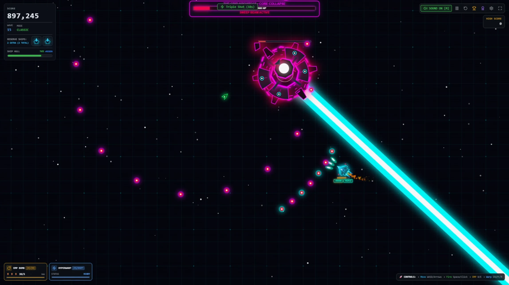
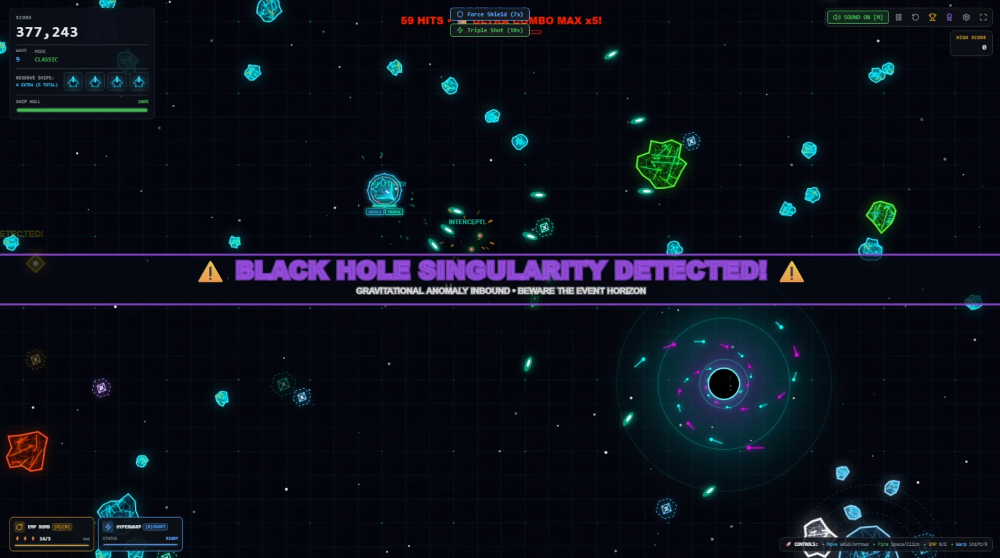
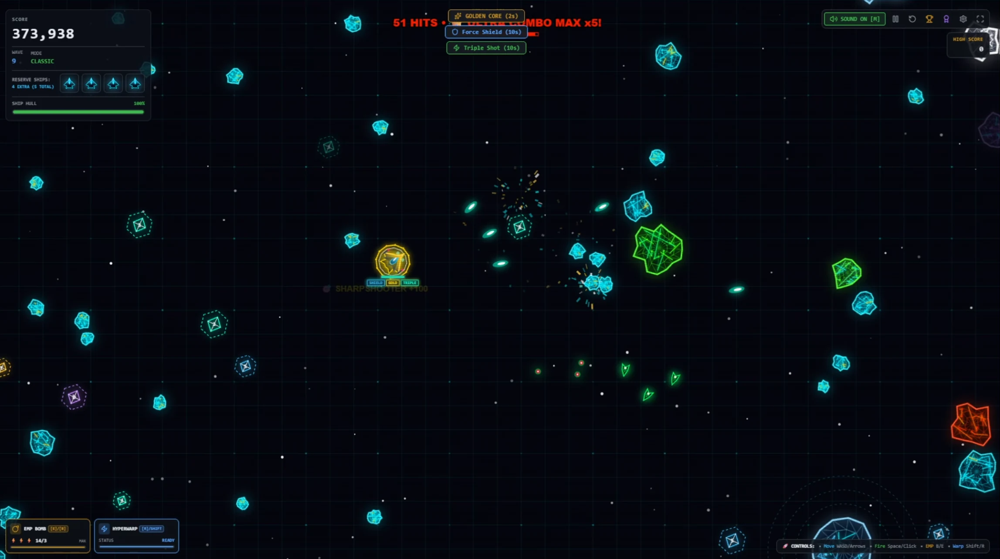
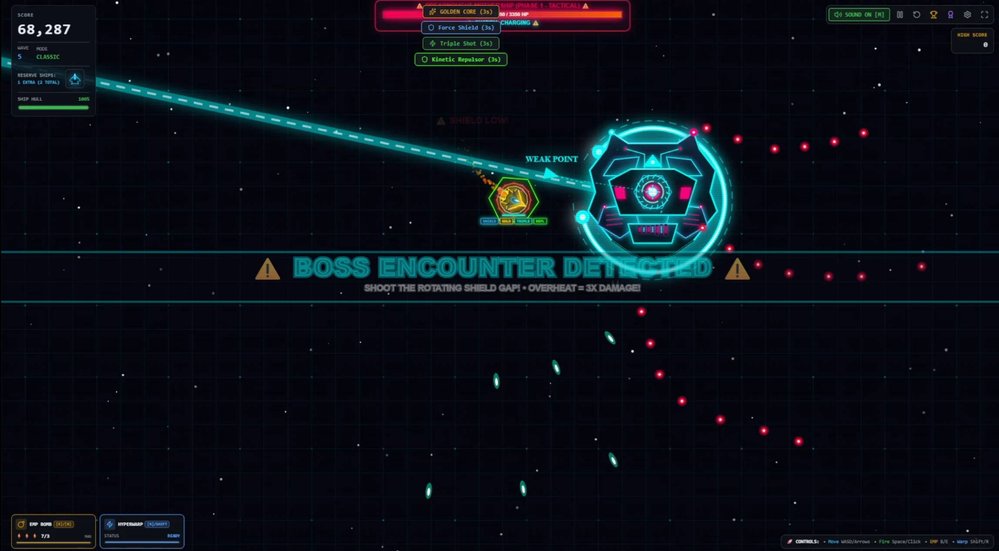
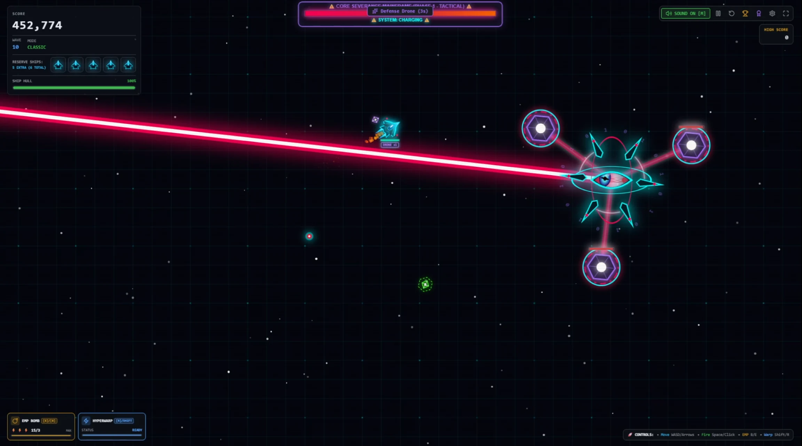

<div align="center">
  <h1>ASTRO VOID</h1>
  <p><strong>Neon vector arcade shooter for desktop, tablet, and mobile.</strong></p>
  <h3><a href="https://astro-smash.vercel.app/">🎮 PLAY NOW</a></h3>
  <br />
  <!-- VIDEO PLACEHOLDER: Insert GitHub hosted gameplay video link here -->
  
</div>

## About
**ASTRO VOID** is a high-octane modern reimagining of the classic arcade space shooter. It combines fluid, physics-based ship movement with dazzling neon vector graphics, chaotic enemy swarms, and massive multi-phase boss encounters. Designed to run smoothly in modern browsers, it scales gracefully across desktop, tablet, and mobile devices.

<div align="center">
  
</div>

## Features
- 🚀 **Intense Vector Combat**: Fluid 60fps action with particle-rich explosions and screen-shaking impacts.
- 📱 **Cross-Platform Play**: Full keyboard/mouse support on desktop, plus seamless dual-stick touch controls for tablets and mobile devices.
- ⚡ **Dynamic Power-ups**: Turn the tide with Triple Shot, EMP, Time Warp, Kinetic Repulsor, and the devastating Hyper Laser Cannon.
- 🎵 **Responsive Audio**: Immersive synthesized soundscape and dynamic feedback for impacts, warnings, and power-ups.
- 🏆 **Deep Scoring System**: Build combo multipliers, maintain accuracy, and trigger stylish wave-clear bonuses.

## Game Modes
- **Classic**: The definitive ASTRO VOID experience. Face progressively difficult waves, challenging bosses, and earn extra lives through score milestones.
- **Survival**: Pure endurance. Only one life, escalating threat levels, and overwhelming enemy numbers. How long can you last?
- **Zen Void**: A relaxed, endless sandbox mode with no game-over. Infinite lives and continuous action.

## Threat Levels
Tune the simulation to your skill level:
- **Easy**: The baseline experience. Forgiving hostile cadence and normal game speeds.
- **Normal**: Noticeably harder. Increased hostile speed, faster enemy projectiles, and aggressive boss patterns.
- **Hard**: Relentless. Enemies swarm rapidly, projectiles fly faster, and bosses offer little breathing room.

## Boss Encounters
Face off against massive, screen-filling bosses every 5 waves:
- **Wave 5: Dreadnought** – A colossal shielded mothership. Thread the needle through its rotating kinetic shields and exploit its exhaust vent vulnerabilities.
- **Wave 10: Core Severance** – A biblically accurate AI seraphim. Destroy its orbiting shield nodes while dodging sweeping death beams and orbital strikes.
- **Wave 15: Grid Architect** – The ultimate master program. A grueling three-phase encounter featuring reflective armor, desperate bullet-hell spirals, and devastating gravity pulses.

## Power-ups and Systems
Destroy special UFOs and glowing asteroids to secure exotic drops:
- 🔫 **Hyper Laser**: A piercing beam that cuts through asteroids, swarms, and deals concentrated DPS to bosses.
- 💥 **EMP**: A screen-clearing pulse that annihilates weak enemies and heavily damages bosses.
- 🛡️ **Deflector Shield**: Temporary invulnerability against one fatal impact.
- ⏱️ **Time Warp**: Slow down time and hostile physics while maintaining your ship's maneuverability.

## Controls
ASTRO VOID supports multiple input methods natively.

**Desktop (Keyboard / Mouse):**
- **W / Up Arrow**: Thrust forward
- **S / Down Arrow**: Reverse thrust / Brake
- **A / D or Left / Right**: Rotate ship
- **Space / Click**: Fire primary weapon
- **E / B**: Trigger EMP
- **R / Shift**: Hyperspace (Random teleport)
- **P / Esc**: Pause game
- **M**: Mute audio

**Touch (Tablet / Mobile):**
- **Left Virtual Joystick**: Move and thrust
- **Right Virtual Joystick**: Aim and fire continuously
- **On-Screen Buttons**: EMP, Hyperspace, Pause, and Menu options are provided natively in the HUD.

## Screenshots

<div align="center">
  
  
  
</div>

## Tech Stack
- **React 19**
- **TypeScript**
- **Vite**
- **Tailwind CSS**
- **Framer Motion** (for UI animations)
- **HTML5 Canvas** (for high-performance game rendering loop)

## Local Development

Ensure you have Node.js installed, then clone the repository:

```bash
# Install dependencies
npm install

# Start the local development server
npm run dev
```

### Development Note
For boss testing and tuning, append `?bossTest=1` to the game URL. This reveals a hidden DEV / BOSS TEST section on the mission-select screen with direct shortcuts to the Wave 5 Dreadnought, Wave 10 Core Severance, and Wave 15 Grid Architect encounters.
